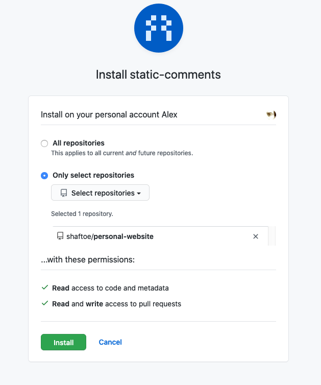

# static-comments

A [Probot based](https://probot.github.io/) NodeJS application that enables comments for "Static Site Generated" websites hosted on GitHub

## Install

You can either host your own `static-comments` instance (for example on Heroku) then install it in your GitHub account, or just install the public application directly which make use of the instance I maintain (i.e. feel free to use but at your own risk).

### Install your own static-comments Probot application

```bash
git clone https://github.com/shaftoe/static-comments
cd static-comments
npm install
npm run start
```

then open `http://localhost:3000/` in your browser and follow the instructions to install your own application in your GitHub account.

You can also have a look at the [Ansible playbook](ansible-deploy.yaml) file that I use do deploy my instance on a Debian Buster server for hints on how to host it yourself. It should be fairly easy to deploy on something like Heroku but I've not tried yet.

### Install the public static-comments Probot application

Log into your GitHub account and install the app from [its public page](https://github.com/apps/static-comments).

At some point you should be able to see something like this: 

WARNING: at the moment this is to be considered as *experimental* software so I give no guarantees whatsoever that this instance will be available and/or work as expected, use at your own risk.

## Architecture

The application itself is very simple: `Probot` takes care of all the heavy lifting required to install, authenticate and interact with GitHub. `static-comments` simply listen for `HTTP` requests, parses the content of any new `POST /static-comments/new` request (for example one sent from an HTML url encoded form submission) and finally creates a new pull request on the repository specified in the `POST` data payload with the user-generated (form) content.

The comment content and configuration sent via `POST` are parsed and saved (with useful metadata like creation time and unique id) in a `json` file blob in a path specified in the configuration payload, making it available for code review. When merged to the website codebase it can be read by any static site generator (for my blog I use [Hugo](https://gohugo.io/) for example) to display comments as HTML.

The relevant comment parsing implementation is in the [comment](lib/comment.js) module and everything needed to create a Pull Request with a `comment` object is in the [github-utils](lib/github-utils.js) module.

Here you can see [a real example][hugo-2] used to enable comments for [my Hugo website](https://a.l3x.in/).

## POST content

The absolute minimum configuration in the POST payload is the following:

- `config[repo]`: the GitHub repository where to open the pull requests, e.g. `shaftoe/personal-website`
- `config[path]`: the base folder where to create the file for the pull request, e.g. `data/blog/my-blog-entry-title`
- `content`: any arbitrary (nested or not) data with comment content, e.g. `my simple comment`

NOTE: support for MD5 hashing is offered out of the box (any `content` key ending in `#md5` will have its content hashed in the pull request), which is useful for example if you'd like to store an email address' MD5 hash that can be used to display a Gravatar image: `content[email#md5]=some@email.here`. Check the [provided Hugo example][hugo-1] for more details.

## Example

This is how a pull request file (`data/somefolder/1599834191610-460f0afb-a0f9-40c0-94e6-e072d66d5a49.json`) content looks like:

```json
{
    "id": "460f0afb-a0f9-40c0-94e6-e072d66d5a49",
    "created": "2020-09-11T14:23:11.610Z",
    "comment": {
        "body": "static-comments is awesome",
        "name": "Alex",
        "email#md5": "0a74859ec2d68811668fc44bb32b53e5"
    }
}
```

The following command has been used to create the pull request:

```bash
time http --form POST https://comments.l3x.in/new \
    comment[body]="static-comments is awesome" \
    comment[name]="Alex" \
    comment[email#md5]="<my@real.email>" \
    config[path]="data/somefolder" \
    config[repo]="shaftoe/testing-pr" \
    config[redirect]="https://a.l3x.in/"

HTTP/1.1 301 Moved Permanently
Connection: keep-alive
Content-Length: 52
Content-Type: text/plain; charset=utf-8
Date: Fri, 11 Sep 2020 14:23:20 GMT
Keep-Alive: timeout=5
Location: https://a.l3x.in/
Vary: Accept
X-Powered-By: Express

Moved Permanently. Redirecting to https://a.l3x.in/

real 0m10.336s
user 0m0.561s
sys 0m0.173s
```

## Credits

This project has been heavily inspired by [Staticman](https://staticman.net). `static-comments` is basically a very simple version of `Staticman` without many of its features and available as GitHub application. The main benefit of using `static-comments` over `Staticman` is that you don't need to create any dedicated GitHub user nor generate Oauth tokens to let `static-comments` interact with your GitHub repositories and you can select which ones it has read/write access to (at install time it asks for the very minimum permissions needed to create a pull request).

## Contributions / Contacts

[Pull requests][pull-requests] are welcome.

You can also send me a message from my [contact page](https://a.l3x.in/contact) or probably find me hanging out in the [Probot Slack channel](https://probot-slackin.herokuapp.com/).

[hugo-1]: https://github.com/shaftoe/personal-website/blob/master/layouts/partials/comments-form.html#L16
[hugo-2]: https://github.com/shaftoe/personal-website/blob/master/layouts/partials/comments-form.html#L41
[pull-requests]: <https://github.com/shaftoe/static-comments/pull/new/master>
